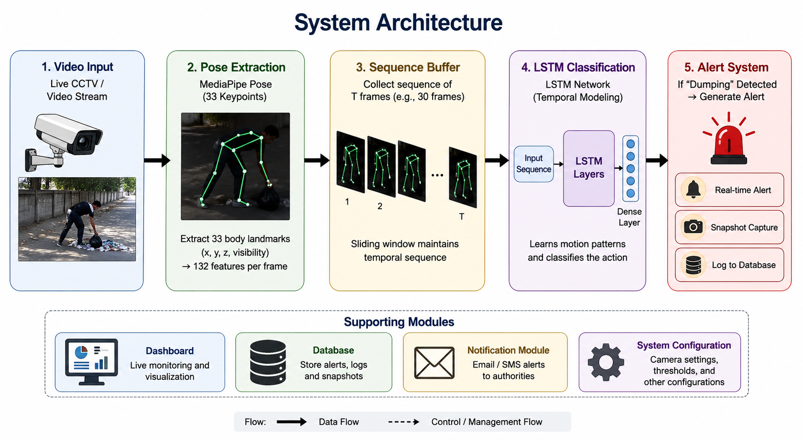

# 🚮 AI-Based Illegal Garbage Dumping Detection System

An intelligent real-time surveillance system that detects unauthorized garbage dumping using **Computer Vision**, **Pose Estimation**, and **Deep Learning**. The system automatically analyzes surveillance footage, recognizes dumping activities, captures evidence, logs incidents, and generates alerts for monitoring authorities.

---

## 📌 Overview

Illegal garbage dumping is a significant environmental and public health concern. Traditional CCTV surveillance requires continuous manual monitoring, making it inefficient for large-scale deployments.

This project automates the detection process by combining **MediaPipe Pose**, **LSTM-based action recognition**, and **YOLOv8 object detection** to identify illegal dumping activities in real time while preserving user privacy by relying on skeletal pose information instead of facial recognition.

---

## 🏗️ System Architecture

<p align="center">

</p>

### Detection Pipeline

```text
Video Input
      │
      ▼
MediaPipe Pose Extraction
      │
      ▼
Temporal Sequence Generation
      │
      ▼
LSTM Action Recognition
      │
      ▼
YOLOv8 Object Detection
      │
      ▼
Decision Fusion
      │
      ▼
Alert Generation
      │
      ▼
Evidence Logging & Dashboard
```

---

## ✨ Key Features

* 🎥 Real-time surveillance video processing
* 🧍 Human pose estimation using MediaPipe Pose
* 🧠 LSTM-based temporal action recognition
* 📦 YOLOv8 object detection integration
* 🚨 Automatic illegal dumping detection
* 📸 Snapshot capture for detected incidents
* 📊 Event logging with timestamps
* 📧 Email notifications
* 📱 SMS alerts using Twilio
* ⚡ Confidence-based decision fusion
* 💻 Lightweight CPU-friendly deployment

---

## 🛠️ Technology Stack

| Category             | Technologies      |
| -------------------- | ----------------- |
| Programming Language | Python            |
| Deep Learning        | TensorFlow, Keras |
| Computer Vision      | OpenCV            |
| Pose Estimation      | MediaPipe Pose    |
| Object Detection     | YOLOv8            |
| Backend              | FastAPI           |
| Notifications        | SMTP, Twilio API  |
| Data Processing      | NumPy             |

---

## ⚙️ Project Workflow

1. Capture video frames from CCTV or surveillance cameras.
2. Extract 33 human skeletal landmarks using MediaPipe Pose.
3. Construct temporal pose sequences.
4. Perform activity classification using an LSTM model.
5. Detect relevant objects using YOLOv8.
6. Fuse predictions to improve reliability.
7. Generate alerts for detected dumping events.
8. Store snapshots and maintain detection logs.

---

## 📂 Dataset

A custom dataset was created specifically for this project due to the absence of publicly available datasets for unauthorized garbage dumping.

### Classes

* Normal Human Activities
* Unauthorized Garbage Dumping

Each sample consists of **30 consecutive frames** represented as **132-dimensional pose feature vectors** extracted using MediaPipe Pose.

---

## 📸 Sample Detection

Detection snapshots are available in the **screenshots/** directory.

---

## 🌍 Applications

* Smart City Surveillance
* Campus Monitoring
* Public Space Monitoring
* Environmental Protection
* Municipal Waste Management
* AI-powered CCTV Analytics

---

## 🚀 Future Enhancements

* Multi-camera surveillance
* Cloud-based monitoring dashboard
* Mobile application for alerts
* Transformer-based action recognition
* Edge AI deployment
* Automatic report generation

---

## 📦 Installation

Clone the repository

```bash
git clone https://github.com/kasinadhan-in/AI-Based-Illegal-Garbage-Dumping-Detection.git
```

Navigate to the backend

```bash
cd backend
```

Install dependencies

```bash
pip install -r requirements.txt
```

Run the detection system

```bash
python dumping_detection.py
```

---

## 📁 Project Structure

```text
AI-Based-Illegal-Garbage-Dumping-Detection/
│
├── backend/
├── frontend/
├── models/
├── screenshots/
├── README.md
├── .env.example
└── .gitignore
```

---

## 📄 License

This project was developed for **academic and research purposes**.
